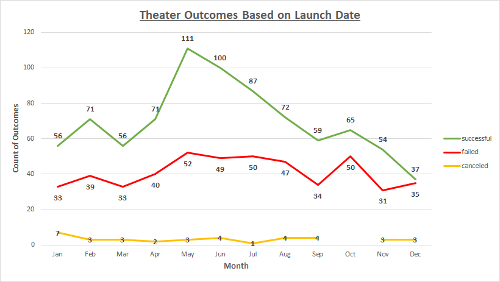

# Kickstarting with Excel

## Overview of Project
The data analyzed in this project will show the effectiveness of Kickstarter campaigns as related to several variables.

### Purpose
The purpose of this analysis is to determine the effect of distinct characteristics to predict the success of the Kickstarter campaign for the play "Fever".
This was accomplished by looking at the data related to "Launch Date", "Fundraising Goal Amount", and "Backers Count" to predict threshold values that may increase the probability of the campaign achieving its financial goal.

## Analysis and Challenges

### Analysis of Outcomes Based on Launch Date

### Analysis of Outcomes Based on Goals

### Challenges and Difficulties Encountered

## Results

- What are two conclusions you can draw about the Outcomes based on Launch Date?

- What can you conclude about the Outcomes based on Goals?

- What are some limitations of this dataset?

- What are some other possible tables and/or graphs that we could create?
