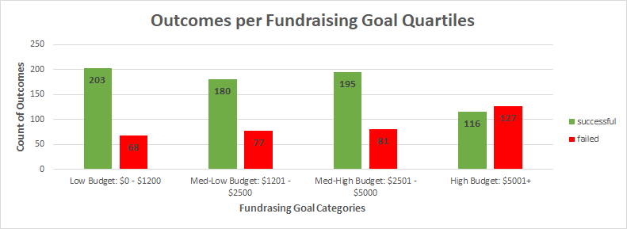

# Kickstarting with Excel

## Overview of Project
The data analyzed in this project will show the effectiveness of Kickstarter campaigns as related to several variables.

### Purpose
The purpose of this analysis is to determine the effect of distinct characteristics to predict the success of the Kickstarter campaign for the play "Fever".
This was accomplished by looking at the data related to "Launch Date", "Fundraising Goal Amount", and "Backers Count" to predict threshold values that may increase the probability of the campaign achieving its financial goal.

## Analysis and Challenges

### Analysis of Outcomes Based on Launch Date

### Analysis of Outcomes Based on Goals

For a more detailed look at outcomes for various goal amounts, the line chart "Outcomes Based on Goal" shows the percentage of successful and failed campaigns for even more categories, this time sectioning the fundraising goal amounts by intervals of roughly $5000. This chart also showcases a generally negative correlation between fundraising goal amounts and probability of a successful outcome. Indeed, the rate of failures is actually higher than the rate of successes for goals of approximately $15000-$35000 and for $45000 and more.

### Challenges and Difficulties Encountered
One of the major challenges I ran into was the unintentional messaging that the line chart "Outcomes Based on Goal" might convey. Because each x-axis value on the line chart represents a range of numbers, it is very likely that a person quickly looking at the chart would come away thinking: "It's a 50% chance of success for a $17500 campaign", since the two lines intersect in the middle of the $15000-$19999 range. Even though the x-axis is made of discrete values, it is very likely that a client would think of it as an axis with continuous values, similar to what they would learn back in school.
The other big challenge I found with the "Outcomes Based on Goal" graph is that it implies an equal distribution between the different fundraising goal intervals. The line chart cannot do justice to the distribution of data, which clearly shows a skewed right distribution (as can be seen in the Box chart below).

To counteract this problem, I grouped the results in categories based on the quartiles (0,1500,3000,7000,-----). Then I created a bar chart to still directly compare the successful vs failed campaigns. While it covers less categories than the line chart, I believe that it still conveys the same negative correlation as the line chart. The one major aspect that is lacking in the bar chart is that it does not show the anamoly of data in the $35000-$44999 range where there were 6 successful plays compared to 3 unsuccessful. That being said, that anamoly itself is not based on enough data points to be considered statistically significant and is not absolutely necessary to highlight in the graph.

## Results

- What are two conclusions you can draw about the Outcomes based on Launch Date?

- What can you conclude about the Outcomes based on Goals?

- What are some limitations of this dataset?

- What are some other possible tables and/or graphs that we could create?
