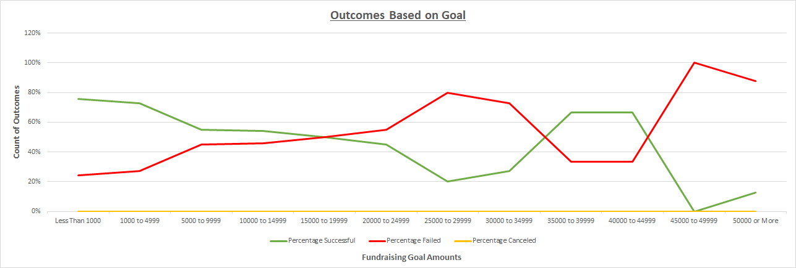

# Kickstarting with Excel

## Overview of Project
The data analyzed in this project will show the effectiveness of Kickstarter campaigns as related to several variables.

### Purpose
The purpose of this analysis is to determine the effect of distinct characteristics to predict the success of the Kickstarter campaign for the play "Fever".
This was accomplished by looking at the data related to "Launch Date" and "Fundraising Goal Amount" to predict threshold values that may increase the probability of the campaign achieving its financial goal.

## Analysis and Challenges

### Analysis of Outcomes Based on Launch Date

This first chart shows the outcome of every project in the "Theater" category organized by the month in which the project was launched. This graph suggests that launching a campaign during the spring offers the best probability of success, which slowly drops off to its lowest probability in late fall/early winter. This trend is shown in two different ways. 

(1) The peak of successes happens in May with a value of 111 successful campaigns. The lowest amount of successes is in December with a value of 37 successful campaigns. This suggests that even though the springtime has many competing projects launching at the same time, many of those projects are still able to find success. And conversely, even though December has the fewest total projects launched to compete against, that month still has the worst rate for success.

(2) The largest spread between successes and failures occurs in the early spring and lasts through early summer while the gap between successes and failures is small in the winter, to the extent that the lines appear to nearly intersect in December. The gap for the spring months is characterized by high success rates for all projects in the months of May (67%), June (65%), and Feb/Apr/July (63%). Meanwhile the success rates for December (49%), October (57%) and January (58%) are the lowest of the twelve months.

### Analysis of Outcomes Based on Goals

The above chart shows results of Kickstarter campaigns for all projects in the "plays" subcategory. The campaigns have been grouped based on the quartile values for all goals, so that each group contains roughly 250-275 project outcomes. The data shows that for the lowest fundraising goals there is approximately a '3:1' ratio of successful campaigns compared to failures, which slowly decreases to a '2.4:1' ratio for campaigns up to $5000. But for the upper 25% of goal values (those higher than $5000) we can see that the success to failure ratio decreases to a nearly '1:1' ratio, with a heavier weight for failures than for successes.

For a more detailed look at outcomes for various goal amounts, the line chart "Outcomes Based on Goal" shows the percentage of successful and failed campaigns for even more categories, this time sectioning the fundraising goal amounts by intervals of roughly $5000. This chart also showcases a generally negative correlation between fundraising goal amounts and probability of a successful outcome. Indeed, the rate of failures is actually higher than the rate of successes for goals of approximately $15000-$35000 and for $45000 and more.

These graphs suggest the budget of $10000 for the play "Fever" may effect its chances to succeed. While it is not a predictor of certain doom, the likelihood of success would increase if the budget were able to be cut to a more lower, more common Kickstarter goal for plays.

### Challenges and Difficulties Encountered
One of the major challenges I ran into was the unintentional messaging that the line chart "Outcomes Based on Goal" might convey. Because each x-axis value on the line chart represents a range of numbers, it is very likely that a person quickly looking at the chart would come away thinking: "A $15000 campaign has a better chance of success than a $19999 campaign", since the 'success' line is higher on the left side of the $15000-$19999 range. Even though the x-axis is made of discrete values, it is very likely that a client would think of it as an axis with continuous values, and conflate the continuous line with the discrete values.

The other big challenge I found with the "Outcomes Based on Goal" graph is that it implies an equal distribution between the different fundraising goal intervals. The line chart cannot do justice to the distribution of data, which clearly shows a skewed right distribution (as can be seen in the Box chart below). In fact, the first data point for projects <$1000 in the line chart represents more projects (186) than the final 9 data points for projects >$10000 all combined (158). It struck me as a problem that 15% of the projects were taking up 75% of the line graph's space.

To counteract this problem, I grouped the results in categories based on the quartiles (0,1500,3000,7000,-----). Then I created a bar chart to still directly compare the successful vs failed campaigns. While it covers less categories than the line chart, I believe that it still conveys the same negative correlation as the line chart. The one major aspect that is lacking in the bar chart is that it does not show the anamoly of data in the $35000-$44999 range where there were 6 successful plays compared to 3 unsuccessful. That being said, that anamoly itself is not based on enough data points to be considered statistically significant and is not absolutely necessary to highlight in the graph.

## Results

- What are two conclusions you can draw about the Outcomes based on Launch Date?
(1) The peak of successes happens in May with a value of 111 successful campaigns. The lowest amount of successes is in December with a value of 37 successful campaigns. This suggests that even though the springtime has many competing projects launching at the same time, many of those projects are still able to find success. And conversely, even though December has the fewest total projects launched to compete against, that month still has the worst rate for success.

(2) The largest spread between successes and failures occurs in the early spring and lasts through early summer while the gap between successes and failures is small in the winter, to the extent that the lines appear to nearly intersect in December. The gap for the spring months is characterized by high success rates for all projects in the months of May (67%), June (65%), and Feb/Apr/July (63%). Meanwhile the success rates for December (49%), October (57%) and January (58%) are the lowest of the twelve months.

- What can you conclude about the Outcomes based on Goals?
There is a negative correlation between fundraising goal amounts and probability of a successful outcome. The rate of failures is actually higher than the rate of successes for goals of approximately $15000-$35000 and for $45000 and more.

- What are some limitations of this dataset?
The biggest limitation of the dataset is a lack of campaigns with very high goal amounts. Since Louise currently has a budget of about $10000 it would be beneficial to have more campaigns with a similar goal to gather data from. Instead we are forced to draw our conclusions from mostly campaigns with less than half of her goal amount.

- What are some other possible tables and/or graphs that we could create?
We could create some bar charts or histograms to show data based on equal amounts of campaigns, be that based on quartiles or percentile chunks of the data. We could also potentially use some pie charts to directly compare "Success" to "Failure" amounts based on different ranges of data. 
